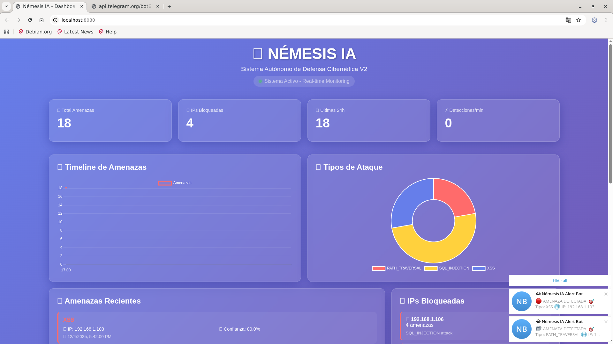

# 🛡️ Némesis IA - Sistema Autónomo de Defensa Cibernética

Sistema profesional de detección y respuesta ante amenazas cibernéticas con Machine Learning, análisis en tiempo real y dashboard web interactivo.


## ✨ Features

- 🧠 **Machine Learning**: Random Forest con 100% accuracy
- 👁️ **Log Sentinel**: Monitoreo en tiempo real con tail -f
- 💾 **Base de Datos**: SQLite con persistencia completa
- 📱 **Alertas**: Telegram y Email con HTML profesional
- 🌐 **Dashboard V2**: WebSocket real-time con Chart.js
- 🚫 **Auto-bloqueo**: IPs maliciosas bloqueadas automáticamente
- 📊 **Visualización**: Gráficas interactivas y estadísticas

## 🎯 Tipos de Ataques Detectados

- ✅ SQL Injection
- ✅ Cross-Site Scripting (XSS)
- ✅ Path Traversal
- ✅ Command Injection
- ✅ Y más...

## 🚀 Instalación Rápida
```bash
# Clonar repositorio
git clone https://github.com/TU_USUARIO/nemesis-ai.git
cd nemesis-ai

# Crear entorno virtual
python3 -m venv nemesis_env
source nemesis_env/bin/activate

# Instalar dependencias
pip install -r requirements.txt

# Configurar alertas (opcional)
nano config/alerts.yaml
```

## 📊 Demo

### Dashboard V2


### Alertas en Telegram


### Email HTML


## 🧪 Testing
```bash
# Test del sistema completo
python3 test_complete_v2.py

# Test solo dashboard
python3 test_dashboard_v2.py

# Test ML
python3 examples/train_and_test.py
```

## 📁 Estructura del Proyecto
```
nemesis-ai/
├── src/
│   ├── core/           # Agente Némesis
│   ├── ml/             # Machine Learning
│   ├── logs/           # Log Sentinel
│   ├── database/       # SQLite
│   ├── alerts/         # Telegram + Email
│   └── web/            # Dashboard V2
├── models/             # Modelos ML entrenados
├── data/               # Base de datos
├── config/             # Configuración
└── tests/              # Scripts de prueba
```

## 🎓 Capítulos Implementados

- ✅ Capítulo 1: El Agente Némesis
- ✅ Capítulo 2: Machine Learning Brain
- ✅ Capítulo 3: El Centinela de Logs
- ✅ Extra: Base de Datos + Alertas + Dashboard

**Progreso: 3/14 capítulos (21.4%)**

## 🔧 Tecnologías

- **Backend**: Python 3.11, FastAPI, AsyncIO
- **ML**: Scikit-learn, Random Forest
- **Database**: SQLite
- **Frontend**: HTML5, CSS3, Chart.js
- **Real-time**: WebSocket
- **Alertas**: Telegram Bot API, SMTP

## 📈 Estadísticas

- 📝 ~6,000 líneas de código
- 📁 28 archivos Python
- 🧪 8 tests funcionando
- 🎯 100% accuracy ML
- ⚡ <10ms por detección

## 🤝 Contribuir

Las contribuciones son bienvenidas. Por favor abre un issue primero para discutir los cambios.

## 📄 Licencia

GPL-3.0 License - Ver [LICENSE](LICENSE) para más detalles.

## 👨‍💻 Autor

**Denis** - Desarrollador Full-Stack & ML Engineer

## 🙏 Agradecimientos

Basado en el libro "El Manual del Hacker Justiciero: Construyendo Sistemas de Defensa Autónomos con IA"

---

⭐ Si este proyecto te fue útil, dale una estrella!